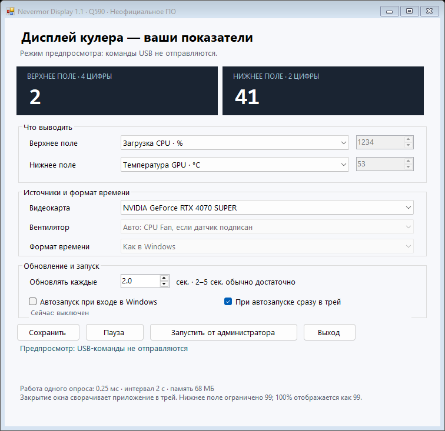

# Nevermor Q590-SD / SD-Q590 — independent unofficial display software

**Проект является независимым неофициальным программным обеспечением и не связан с Nevermor. Все товарные знаки принадлежат их владельцам. Использование осуществляется на собственный риск. Перед применением на реальном оборудовании необходимо проверить совместимость и требования производителя.**

This project is independent, unofficial software and is not affiliated with Nevermor. All trademarks belong to their respective owners. Use at your own risk. Before using it on real hardware, check compatibility and the manufacturer's requirements.

**Nevermor Display** is a lightweight, open-source Windows controller for the numeric display on the **Nevermor Q590-SD** CPU cooler, also listed as **Nevermor SD-Q590**. Choose what appears in the two display fields: CPU/GPU readings, memory use, fan RPM, a clock, seconds, a date, or a fixed number.

**Программа управления дисплеем кулера Nevermor Q590-SD / SD-Q590 для Windows.** Если вы ищете «Q590-SD программа», «Nevermor SD-Q590 драйвер дисплея» или «Q590-SD display software», здесь находятся исходники, инструкция и готовая переносимая программа.

[Русская инструкция](docs/README.ru.md) · [USB protocol](docs/PROTOCOL.md) · [Validation](docs/VALIDATION.md) · [Changelog](CHANGELOG.md)



## Download and start

Download the portable [NevermorDisplay-v1.1.0-win-x64.zip](https://github.com/ACPogadaev/nevermor-q590-sd-display-unofficial/releases/download/v1.1.0/NevermorDisplay-v1.1.0-win-x64.zip) from the [release page](https://github.com/ACPogadaev/nevermor-q590-sd-display-unofficial/releases/tag/v1.1.0). The GitHub **Code → Download ZIP** button downloads source code, not the ready-to-run app.

1. Extract the entire archive into a writable folder.
2. Exit the original **Digital / DeviceDriver.exe** application from its tray icon.
3. Run `NevermorDisplay.exe`. Keep all bundled DLLs beside it.
4. Choose the upper/lower metrics and the refresh interval; click **Сохранить** (Save).
5. Closing the window hides it in the tray. Double-click the tray icon to reopen settings; **Выход** means Exit.

Windows 10/11 x64 with .NET Framework 4.7.2 or later. The current interface is in Russian. Installation is not required. Defaults are CPU load above, GPU temperature below, a 2-second refresh, the Windows clock format, and autostart disabled.

## Features

| Metric | Upper: 4 digits | Lower: 2 digits |
|---|---|---|
| CPU temperature / CPU load | Yes | Yes |
| CPU clock in MHz | Yes | — |
| GPU temperature / GPU load | Yes | Yes |
| GPU clock in MHz | Yes | — |
| RAM use: percent / whole GB | Yes | Yes |
| Selected motherboard fan RPM | Yes | — |
| Clock: Windows / 12-hour / 24-hour | Yes | — |
| Clock seconds | Yes | Yes |
| Date: DDMM | Yes | — |
| Your fixed number | Yes | Yes |

The lower field supports 0–99 and the upper field 0–9999. Values are rounded and clamped; 100% becomes 99 in the lower field. The physical SPEED/TEMP/USAGE labels and °C symbol remain in place. Text, images, and AM/PM letters cannot be sent using the implemented command; AM/PM is shown in the application preview.

Clock mode can turn 13:15 into 1:15 PM. Select **Формат времени → 12 часов**, then Save. Choose **Секунды часов** below and a 1-second interval for separate seconds, or keep a temperature below the clock. Dates are encoded as DDMM: 7 October is 0710. Leading-zero and punctuation behavior belongs to the display firmware.

## Sensors and low overhead

CPU load and RAM use come from native Windows counters. NVIDIA temperature/load/clock use the installed driver’s NVML API. Additional hardware monitoring groups are opened only when selected; the window stops repainting while hidden. One process runs at below-normal priority with a configurable 1–60-second interval and no network requests during normal use.

CPU temperature, CPU clock, and fan RPM require **Запустить от администратора** (Run as administrator). Availability depends on the board, sensors, and Windows driver access. Choose unlabeled `Fan #1`, `Fan #2`, etc. explicitly; the app does not guess that an arbitrary motherboard fan is the CPU fan. Missing values remain unavailable rather than becoming false zeroes.

When an NVIDIA card is present, the GPU selector lists NVIDIA cards. Other GPU types use LibreHardwareMonitor only when the native NVIDIA route is unavailable.

A short measurement on Ryzen 7 7700 / RTX 4070 SUPER, CPU load + GPU temperature every 2 seconds: about **0.0022% of total CPU**, **72.58 MB working set**. This was measured on the initial local build, not a guarantee for every sensor/configuration. Details and test limits are in [validation](docs/VALIDATION.md).

## Autostart

Check **Автозапуск при входе в Windows** and Save. An ordinary launch registers a per-user Windows Run entry. An elevated launch registers a current-user scheduled task with elevated rights, delayed 10 seconds after login. **При автозапуске сразу в трей** controls whether settings stay hidden.

Put the app in its final folder before enabling autostart. Disable the old Digital app’s autostart separately if it is enabled. The controller pauses sending when `DeviceDriver.exe` is detected; it does not terminate the OEM app. To remove elevated autostart, open the controller as administrator, uncheck it, and Save.

## Which USB device is the Q590-SD display?

The tested controller uses **USB HID VID 1A2C / PID 4E84**, vendor usage page FF01, usage 1, Feature Report 7. Device Manager may call it **USB Gaming Keyboard / SEMICO**. This does not mean the program controls a keyboard interface indiscriminately: the controller also verifies HID usage and feature report capabilities.

**CH340 / CH341, USB VID 1A86 PID 7523, and COM3 are not used by the investigated Digital 1.0.0.3 display path.** Other cooler revisions have not been tested. See the [protocol notes](docs/PROTOCOL.md).

## Build and test

On Windows, open PowerShell in the repository folder:

```powershell
powershell -ExecutionPolicy Bypass -File .\scripts\build.ps1
powershell -ExecutionPolicy Bypass -File .\scripts\test.ps1
powershell -ExecutionPolicy Bypass -File .\scripts\package.ps1
```

The build restores pinned official NuGet dependencies and uses the Windows .NET Framework compiler. No Visual Studio installation is needed. Build-time downloads require internet access. Output goes to `build/app`; portable ZIP and SHA-256 checksums go to `dist`. The self-test does not send USB commands or enable autostart.

Settings are stored as `settings.xml` beside the EXE. Tray menu **Сохранить диагностику** saves current readings/status as `diagnostics.txt`. Generated settings, private diagnostics, binaries, and dependency caches are excluded from source control.

## License and compatibility

The controller source is licensed under [MIT](LICENSE). The hardware monitoring dependency uses MPL 2.0; other bundled dependency notices are listed in [THIRD-PARTY-NOTICES.md](THIRD-PARTY-NOTICES.md). Dependencies are distributed unmodified, with their license/source references.

This is an independent community project, not an official Nevermor release. USB updates have been verified on one Q590-SD and visually confirmed by its owner. CPU temperature/RPM with the new public dependency build and actual Windows login autostart require separate validation; please include model revision, selected metrics, and the displayed status when reporting an issue, and remove personal paths from diagnostics.
